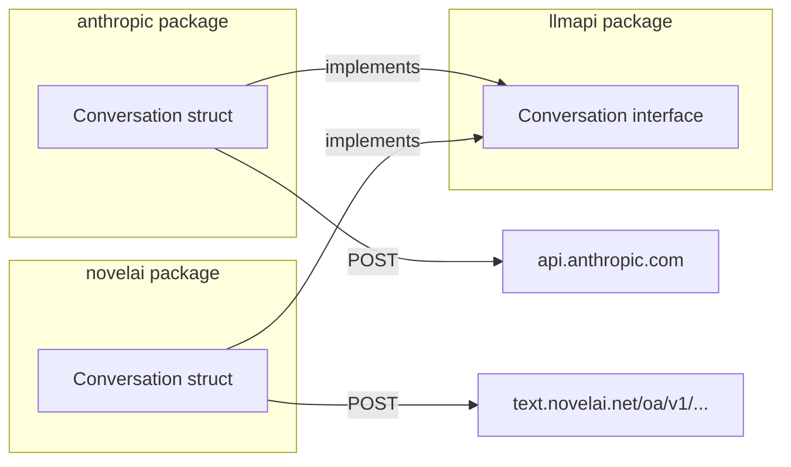

# NovelAI Go API Library

Create `github.com/wbrown/novelai` - a Go library for NovelAI's OpenAI-compatible GLM endpoints that mirrors the `anthropic` library's API design.

---

## Architecture



---

## File Structure

```
~/src/novelai/
├── go.mod              # module github.com/wbrown/novelai
├── api.go              # Conversation, Send, SendUntilDone
├── types.go            # Settings, message types, request/response structs
├── streaming.go        # SSE streaming support
├── api_test.go         # Tests
└── README.md           # Documentation
```

---

## Core Types (`types.go`)

```go
package novelai

// Settings configures generation parameters.
type Settings struct {
    Model       string  // "glm-4-6", "llama-3-erato-v1"
    MaxTokens   int     // Default: 2048
    Temperature float64 // Default: 1.0
    TopP        float64
    TopK        int
    MinP        float64
    
    // Penalty parameters
    FrequencyPenalty float64
    PresencePenalty  float64
    RepetitionPenalty float64
    
    // Stop sequences
    StopSequences []string
}

// DefaultSettings for NovelAI GLM-4
var DefaultSettings = Settings{
    Model:       "glm-4-6",
    MaxTokens:   2048,
    Temperature: 1.0,
}

// Usage tracks token consumption.
type Usage struct {
    InputTokens  int
    OutputTokens int
}
```

---

## Conversation Struct (`api.go`)

```go
package novelai

import "net/http"

const chatCompletionsURL = "https://text.novelai.net/oa/v1/chat/completions"

// Package-level defaults
var DefaultApiToken string
var DefaultSettings = Settings{Model: "glm-4-6", MaxTokens: 2048, Temperature: 1.0}

// Conversation manages a chat session with NovelAI.
type Conversation struct {
    System   string      // System prompt
    Messages []Message   // Conversation history
    Usage    Usage       // Cumulative token usage
    
    // Configuration
    ApiToken   string
    Settings   Settings
    HttpClient *http.Client
}

// Message represents a chat message.
type Message struct {
    Role    string `json:"role"`    // "system", "user", "assistant"
    Content string `json:"content"`
}

// NewConversation creates a new conversation with the given system prompt.
func NewConversation(system string) *Conversation {
    return &Conversation{
        System:     system,
        Messages:   make([]Message, 0),
        ApiToken:   DefaultApiToken,
        Settings:   DefaultSettings,
        HttpClient: &http.Client{Timeout: 120 * time.Second},
    }
}
```

---

## Core Methods

### Send

```go
// Send sends a user message and returns the assistant's reply.
// If text is empty, continues from the last message (for max_tokens continuation).
func (c *Conversation) Send(text string) (
    reply string,
    stopReason string,
    inputTokens int,
    outputTokens int,
    err error,
)
```

**Implementation:**

1. If `text != ""`, append user message to history
2. Build OpenAI-format request with system + messages
3. POST to `chatCompletionsURL`
4. Parse response, append assistant message to history
5. Normalize stop reason: `"stop"` → `"end_turn"`, `"length"` → `"max_tokens"`
6. Update cumulative usage
7. Return

### SendUntilDone

```go
// SendUntilDone repeatedly calls Send until stop_reason != "max_tokens".
// Returns the complete accumulated output.
func (c *Conversation) SendUntilDone(text string) (
    reply string,
    stopReason string,
    inputTokens int,
    outputTokens int,
    err error,
)
```

**Implementation:**

1. Call `Send(text)`
2. While `stopReason == "max_tokens"`:

   - Call `Send("")` (continue)
   - Append to accumulated reply
   - Sum tokens

3. Return accumulated result

---

## Additional Methods (mirroring anthropic)

```go
// AddMessage manually adds a message to the conversation history.
func (c *Conversation) AddMessage(role string, content string)

// GetMessages returns the current conversation history.
func (c *Conversation) GetMessages() []Message

// GetUsage returns cumulative token usage.
func (c *Conversation) GetUsage() Usage

// GetSystem returns the system prompt.
func (c *Conversation) GetSystem() string

// SetModel changes the model for subsequent calls.
func (c *Conversation) SetModel(model string)

// Clear resets the conversation history (keeps system prompt).
func (c *Conversation) Clear()
```

---

## Streaming Support (`streaming.go`)

```go
// StreamCallback is called for each token during streaming.
type StreamCallback func(text string, done bool)

// SendStreaming sends with real-time token streaming.
func (c *Conversation) SendStreaming(text string, callback StreamCallback) (
    reply string,
    stopReason string,
    inputTokens int,
    outputTokens int,
    err error,
)
```

**Implementation:** Uses SSE (Server-Sent Events) with `stream: true` in the request.

---

## Request/Response Types

```go
// OpenAI-compatible request format
type chatRequest struct {
    Model       string    `json:"model"`
    Messages    []Message `json:"messages"`
    MaxTokens   int       `json:"max_tokens,omitempty"`
    Temperature float64   `json:"temperature,omitempty"`
    TopP        float64   `json:"top_p,omitempty"`
    TopK        int       `json:"top_k,omitempty"`
    MinP        float64   `json:"min_p,omitempty"`
    Stream      bool      `json:"stream,omitempty"`
    Stop        []string  `json:"stop,omitempty"`
}

// OpenAI-compatible response format
type chatResponse struct {
    ID      string `json:"id"`
    Object  string `json:"object"`
    Created int64  `json:"created"`
    Model   string `json:"model"`
    Choices []struct {
        Index        int     `json:"index"`
        Message      Message `json:"message"`
        FinishReason string  `json:"finish_reason"`
    } `json:"choices"`
    Usage struct {
        PromptTokens     int `json:"prompt_tokens"`
        CompletionTokens int `json:"completion_tokens"`
    } `json:"usage"`
}
```

---

## Interface Compliance

```go
import "github.com/wbrown/llmapi"

// Verify Conversation implements the llmapi interface at compile time
var _ llmapi.Conversation = (*Conversation)(nil)
```

---

## Usage Example

```go
package main

import (
    "fmt"
    "os"
    "github.com/wbrown/novelai"
)

func main() {
    novelai.DefaultApiToken = os.Getenv("NAI_API_KEY")
    
    conv := novelai.NewConversation("You are a helpful assistant.")
    conv.Settings.Model = "glm-4-6"
    conv.Settings.Temperature = 0.8
    
    reply, stopReason, inTok, outTok, err := conv.Send("Hello!")
    if err != nil {
        panic(err)
    }
    
    fmt.Printf("Reply: %s\n", reply)
    fmt.Printf("Stop: %s, Tokens: %d in / %d out\n", stopReason, inTok, outTok)
    
    // Continue the conversation
    reply, _, _, _, _ = conv.Send("Tell me more.")
    fmt.Printf("Reply: %s\n", reply)
}
```

---

## Differences from Anthropic

| Feature | anthropic | novelai |

|---------|-----------|---------|

| API Format | Anthropic Messages API | OpenAI Chat Completions |

| Stop Reasons | `end_turn`, `max_tokens` | Normalized from `stop`, `length` |

| Extended Thinking | Yes | No |

| Tool Use | Yes | No |

| Prompt Caching | Yes | No |

| MinP/TopK | No | Yes |

| Content Blocks | Yes (complex) | No (simple strings) |

---

## Implementation Order

1. **`types.go`** - Settings, Message, Usage, request/response structs
2. **`api.go`** - Conversation struct, NewConversation, Send
3. **`api.go`** - SendUntilDone, AddMessage, GetMessages, GetUsage
4. **`streaming.go`** - SendStreaming with SSE parsing
5. **`api_test.go`** - Unit tests with mock server
6. **Interface compliance** - Add llmapi interface methods

---

## Environment Variables

| Variable | Purpose |

|----------|---------|

| `NAI_API_KEY` | NovelAI persistent API token |

| `NAI_MODEL` | Default model (optional) |